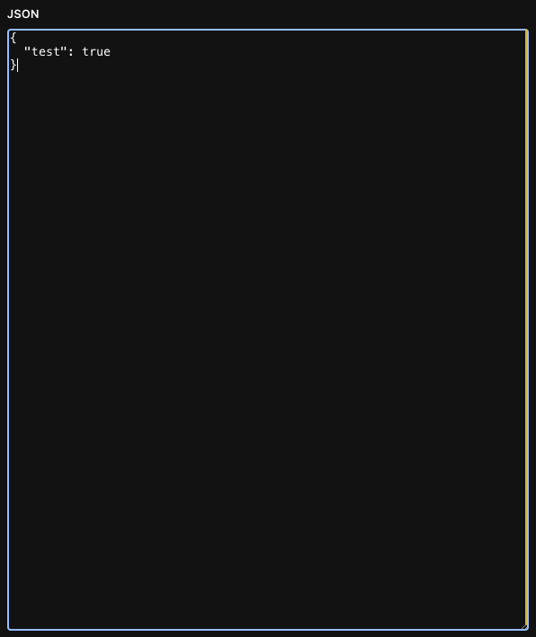
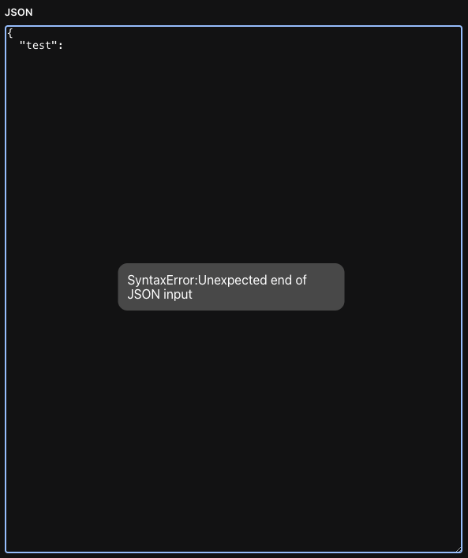

# sanity-plugin-input-json

> Simple JSON editor for Sanity Studio v3

Validates JSON on change and auto saves a serialised JSON string when valid.

## Installation

```sh
npm install sanity-plugin-input-json
```

## Usage

Add it as a plugin in `sanity.config.ts` (or .js):

```ts
import {defineConfig} from 'sanity'
import {inputJson} from 'sanity-plugin-input-json'

export default defineConfig({
  //...
  plugins: [inputJson({})],
})
```

## Screenshots

### Valid JSON



### Invalid JSON



## License

[MIT](LICENSE) © Duane Cilliers

## Develop & test

This plugin uses [@sanity/plugin-kit](https://github.com/sanity-io/plugin-kit)
with default configuration for build & watch scripts.

See [Testing a plugin in Sanity Studio](https://github.com/sanity-io/plugin-kit#testing-a-plugin-in-sanity-studio)
on how to run this plugin with hotreload in the studio.
